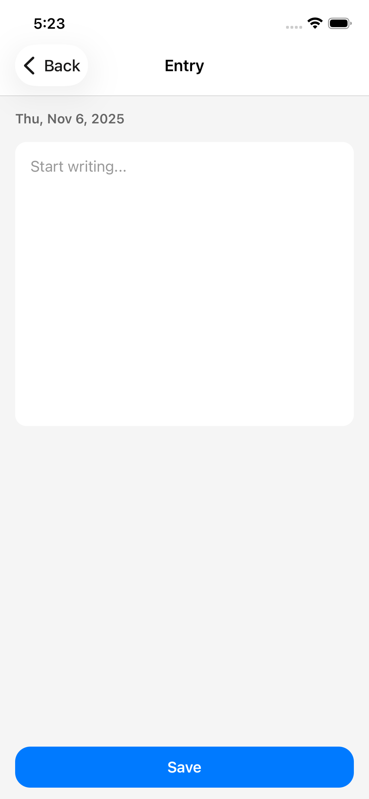

# Journal App

A simple and elegant React Native journal application following Apple's iOS design guidelines.

## Features

- ✍️ Create journal entries by date
- 📝 Edit existing entries
- 🗑️ Delete entries
- 📱 Modern iOS-style UI

## Tech Stack

- **React Native** - Mobile app framework
- **React Navigation** - Screen navigation
- **Context API** - State management
- **Expo** (optional) - Development framework

## Installation

1. Clone the repository

```bash
git clone <repository-url>
cd journal-app
```

2. Install dependencies

```bash
npm install
```

3. Start the app

```bash
npm start
```

## Project Structure

```
├── screens/
│   ├── JournalListScreen.js
│   ├── JournalEntryScreen.js
│   └── EditEntryScreen.js
├── context/
│   └── JournalContext.js
├── utils/
│   └── dateUtils.js
└── App.js
```

## Usage

- Tap the **+** button to create a new entry
- Tap an entry from the list to edit it
- Use the **Delete** button to remove an entry
- All entries are stored in memory (not persisted)

## Screenshots

## Screenshots

|                  Journal List                   |                   Create Entry                   |
| :---------------------------------------------: | :----------------------------------------------: |
|  |  |

## Future Enhancements

- Database persistence (AsyncStorage/Realm)
- Search functionality
- Calendar view
- Tags/Categories
- Dark mode support

## License

MIT
